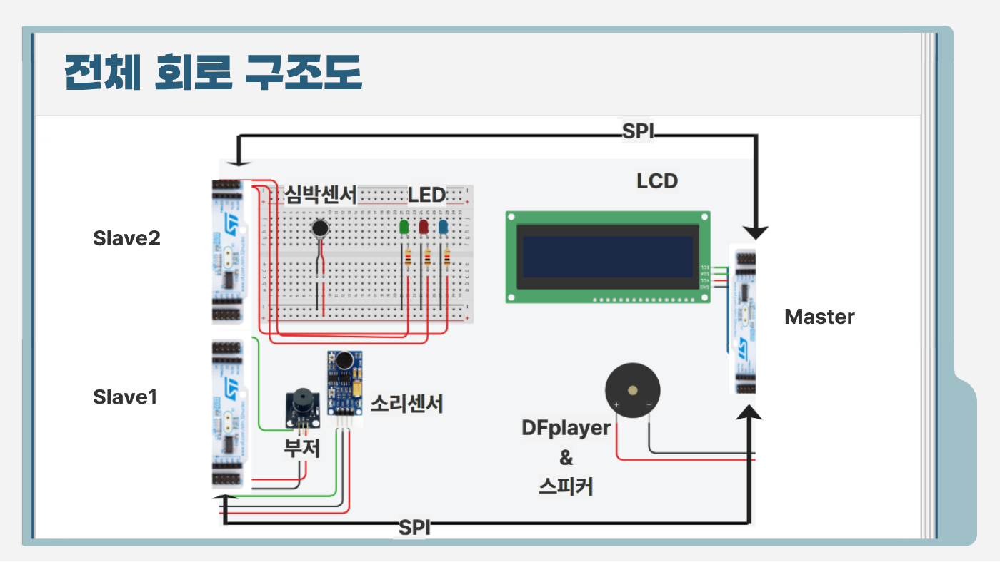
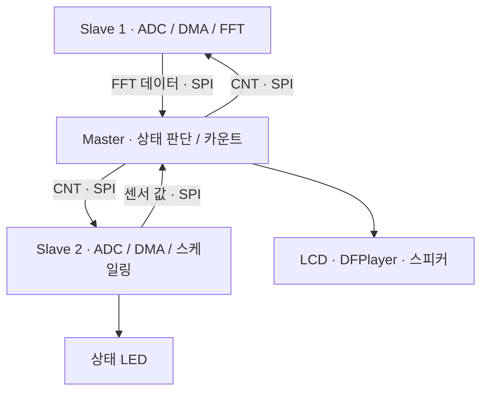

# Heart Rate and Sound FFT-Based Sound Environment Control System for Relaxation

**심박 센서와 환경 소리 FFT를 연동한 STM32 기반 환경 제어 시스템**

2025년 3분기

STM32 3대에 소리 분석, 심박 센서 입력 처리, 통합 제어를 나누고 SPI로 연결한 프로젝트입니다. 아날로그 센서 입력을 ADC와 DMA로 수집하고, 환경 소리의 주파수 정보와 심박 센서 상태에 따라 LCD·LED·음악 재생을 제어했습니다.

센서 입력부터 통신, 상태 판단, 출력까지 이어지는 임베디드 처리 흐름을 구현하고, UART 로그와 PC 그래프로 각 단계의 동작을 관찰했습니다.

[설계·구현](docs/design.md) · [시연·계측 기록](docs/results.md) · [펌웨어 코드](firmware/README.md) · [FFT 뷰어 실행](tools/README.md)



## 핵심 구현

| 항목 | 구현 내용 |
| --- | --- |
| 분산 MCU 구성 | Master 1대와 센서 Slave 2대에 수집·처리·제어 역할 분리 |
| ADC·DMA | 아날로그 센서 값을 메모리로 전송하고, 심박 센서 경로에 circular DMA와 완료 인터럽트 적용 |
| SPI 양방향 통신 | Slave에서 센서 처리 값을 보내고 Master에서 카운트 값을 돌려주는 데이터 교환 |
| 소리 신호 처리 | ADC 입력의 FFT와 피크 주파수 추출, UART 데이터를 이용한 PC 스펙트럼 표시 |
| 상태 표시·출력 | 심박 센서 입력의 구간별 상태 LED, Master의 LCD·타이머·DFPlayer 제어 |
| 레지스터 제어 | RCC, GPIO, SPI, ADC, DMA 레지스터 직접 설정. 디버그 UART 등에는 HAL 사용 |

## 데이터 흐름



- **Slave 1:** 소리 신호를 수집하고 FFT 결과를 Master로 전달합니다. LMS 기반 소음 제어 구조와 입력·잔차 파형 비교는 [시연·계측 기록](docs/results.md)에 정리했습니다.
- **Slave 2:** 심박 센서의 ADC 값을 구간별 수치로 변환해 전송하고, LED로 상태를 표시합니다.
- **Master:** 센서 데이터를 받아 상태와 누적 시간을 표시합니다. 집중 모드에서 시간을 누적하고 백색소음을 재생하며, 비집중 모드에서 타이머를 초기화하고 재생을 중지합니다.

## 시연과 DMA 계측


[시연 녹화](media/demo.mp4)

DMA를 적용해 센서 데이터 전송을 구성하고, 적용 전후의 처리 cycle을 비교했습니다.

| 경로 | 적용 전 | 적용 후 | 기록값 기준 감소율 |
| --- | ---: | ---: | ---: |
| Slave 1 소리 처리 | 약 23,000 cycles | 약 5,900 cycles | 약 74% |
| Slave 2 센서 처리 | 95 cycles | 54 cycles | 약 43% |

계측 수치와 계산 과정은 [시연·계측 기록](docs/results.md)에 정리했습니다.

## 저장소 구성

| 경로 | 내용 |
| --- | --- |
| [`firmware/reconstructed/`](firmware/reconstructed/) | 세 노드의 응용 코드, STM32F1 HAL 연결, LCD·DFPlayer 및 호스트 테스트 |
| [`firmware/report-excerpts/`](firmware/report-excerpts/) | 심박 센서 노드의 레지스터 초기화·ISR·루프 코드 발췌본 |
| [`firmware/spi-reference/`](firmware/spi-reference/) | SPI1 Master 예제 |
| [`tools/fft_viewer.py`](tools/fft_viewer.py) | 포트·통신 속도·FFT 설정을 인자로 지정하는 PC 뷰어 |
| [`docs/`](docs/) | 설계·구현, 시연·계측, 자료 목록 |
| [`archive/`](archive/) | 원본 Python 스크립트 |
| [`media/demo.mp4`](media/demo.mp4) | 제공된 시연 녹화 파일 |

CubeIDE가 생성하는 클럭·핀·주변장치 초기화에 연결할 응용 코드를 [재구성 안내](firmware/reconstructed/README.md)에 정리했습니다. 심박 스케일링은 남은 코드를 유지했고, Master와 소리 노드는 기록된 동작을 재구현했습니다. 호스트 통합 테스트와 공식 STM32CubeF1 헤더를 사용한 Cortex-M3 객체 컴파일을 통과했습니다. 실제 보드 구동과 스피커를 포함한 능동 소음 제어는 검증하지 않았습니다.

## FFT 뷰어 실행

```bash
python -m pip install -r requirements.txt
python tools/fft_viewer.py --port COM5
```

기본값은 원본 스크립트의 `115200 baud`, `FFT_SIZE=128`, `Fs=8000 Hz`를 따릅니다. 장치가 보내는 `FFT:` 접두사의 64개 정수 값을 표시합니다. 주파수 축 설정은 실제 송신 펌웨어의 샘플링률·FFT 길이에 맞춰 사용합니다.

통신 형식, Linux 포트 예시, 재생 옵션은 [도구 문서](tools/README.md)에 있습니다.

## 팀

팀장:김우석(전체 아키텍처 및 동작 설계, 문서 및 산출물관리) · 권지훈 · 강덕현 · 박규나 · 박하빈

[자료 목록](docs/sources.md)
