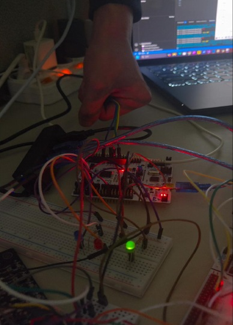

# 시연과 계측 기록

## 시연 구성

시연은 브레드보드에 연결된 MCU·센서·LED, 손가락을 이용한 심박 센서 입력, UART 상태 화면, PC FFT 그래프로 구성했다. 녹화 파일은 [`media/demo.mp4`](../media/demo.mp4)에 보관했다.

센서 입력은 UART 로그와 LED로, 소리 신호는 주파수별 FFT 그래프로 관찰했다. 센서 값의 계산식과 LED 분기는 [설계·구현](design.md#스케일링-식과-led)에 정리했다.

## DMA 적용 전후 기록

| 측정 항목 | 적용 전 | 적용 후 | 계산 |
| --- | ---: | ---: | --- |
| Slave 1 | 약 23,000 cycles | 약 5,900 cycles | `(23000-5900)/23000 ≈ 74.3%` 감소 |
| Slave 2 | 95 cycles | 54 cycles | `(95-54)/95 ≈ 43.2%` 감소 |

Slave 1의 캡처 로그에는 적용 전 23,630–23,703 cycles, 적용 후 5,952–5,953 cycles가 보인다. README 표에는 반올림 수치를 사용했다.

Slave 2의 처리 cycle은 적용 전 95 cycles, 적용 후 54 cycles로 기록했다.

## 소음 제어 기록

LMS 피드백 구조에서 마이크 입력 `x[n]`과 잔차 `e[n]`의 파형을 비교했다. 소리 수집과 출력의 관계를 시간 영역 파형으로 관찰한 기록이다.

## 프로젝트에서 다룬 기술

- ADC 결과의 메모리 전송을 DMA로 구성하고 완료 인터럽트와 후속 처리를 연결했다.
- 세 노드의 역할과 SPI 데이터 방향을 정의하고 센서 값을 출력 장치까지 전달했다.
- 레지스터 설정, UART 로그, PC FFT 표시를 함께 사용해 임베디드 신호 처리 경로를 관찰했다.

이 프로젝트를 통해 센서 수집, MCU 간 통신, 상태 판단, 출력 제어를 하나의 시스템으로 연결했다.
